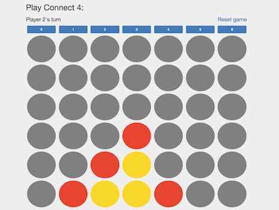

Introduction 
=================================

### [Try out project here](http://connect4.muhsinali.xyz)

### How to run the web app
To run the web app locally, start the MongoDB database using `mongod` and then go to the root directory of this project and run `activator run`. Once ready, go to [http://localhost:9000](http://localhost:9000) (if running for the first time, will need to wait a bit for the source code to compile).

### Tech stack
- Scala 2.11.8
- Play framework (version 2.5.12)
- HTML, CSS, Bootstrap 3, [Twirl template engine](https://www.playframework.com/documentation/2.5.x/ScalaTemplates)
